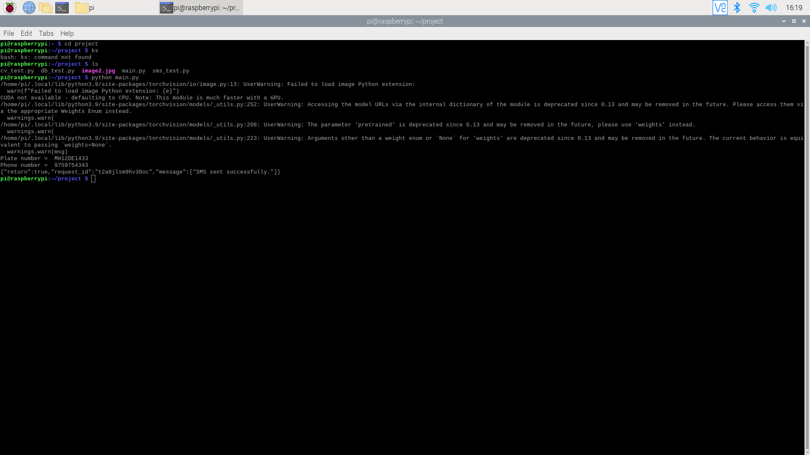
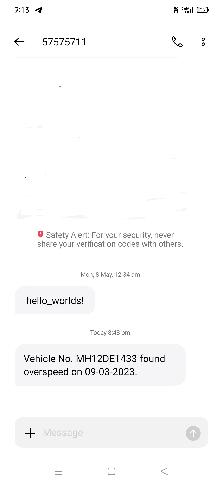

# Integrated Traffic E-Challan System

## Project Overview

The Integrated Traffic E-Challan System is an innovative solution that automates traffic violation processing using a combination of hardware and software components. This project aims to streamline the process of generating e-challans for traffic violations, making it efficient and accurate for law enforcement agencies.

## Features

- Real-time image capture and processing using Raspberry Pi.
- Accurate vehicle detection and license plate recognition through OpenCV and EasyOCR.
- Efficient data management using MySQL database for storing violation records, images, and fine details.

## Installation and Usage

1. Clone the repository: `git clone https://github.com/yourusername/integrated-e-challan.git`
2. Navigate to the project directory: `cd integrated-e-challan`
3. Follow the installation steps for each component (Raspberry Pi setup, software dependencies, database setup, etc.).
4. Run the system using the provided instructions.

## Contributions

Contributions are welcome! If you'd like to contribute to the project, follow these steps:
1. Fork the repository.
2. Create a new branch: `git checkout -b feature/your-feature-name`
3. Commit your changes: `git commit -m 'Add a new feature'`
4. Push to the branch: `git push origin feature/your-feature-name`
5. Create a pull request, explaining your changes and their impact.

## Contact

For questions or inquiries, please contact [Your Name](mailto:youremail@example.com).
